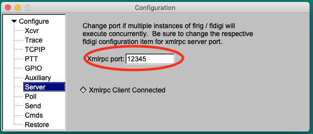

#Cat-relay

## About
Cat-relay is a tool to turn your SDR into a band scope/panadapter
for your radio. It does this by synchronizing the frequencies and modes
of your SDR software and your radio transceiver.

## Download
Please go to [Release Page](https://github.com/n2iw/cat-relay/releases) to download latest version of Cat-relay. 
Mac and Windows versions don't require any installation, you can unzip it and double click to run.

## Supported platforms and software
Cat-relay was written in Python3 and can run on Mac, Windows and Linux. 
Ready to use executable files are provided for Mac and Windows platforms.

Currently, Cat-relay mainly supports one SDR software - SDR++ (cross-platform). However, Cat-relay may work with other SDR software if they provide a
Hamlib/Rigctl compatible TCP server.

Cat-relay supports following radio control software:
* RUMlogNG (Mac)
* Flrig (cross platform)
* DXLab Commander (Windows)
* N1MM+ (Windows) 

Cat-relay may also work with other radio control software if they provide one of two interfaces:
* A DXLab Commander compatible TCP interface. 
* A Flrig compatible XML/RPC server.

At this moment, only SDR++, RUMlogNG, DXLab Commander, Flrig and N1MM+ are
tested. MacLoggerDX may also work, except changing modes on SDR is not supported by MacLoggerDX. 

## Settings
To change settings, click the "Setting" button on the main window. 

 

Most settings are self-explanatory. Here are some useful tips: 

### 1. Match the ports
Make sure "SDR Port" matches the port number in SDR++'s "Rigctl Server" panel. 
  

Make sure "CAT Port" matches the port number in your radio control software.

#### RUMlogNG
 
#### DXLab Commander 
 
#### Flrig 
  
#### N1MM+
 

If you use N1MM+, make sure "Radio Info Port" matches the "radio" port in N1MM+'s "Broadcast Data" configuration page. 
For example, if the "radio" box has "127.0.0.1:12060", put "12060" in Cat-relay's "Radio Info Port" box.

 

### 2. Put in the correct addresses
If you run all the software on the same computer (most people do), keep "SDR running on" and "CAT running on" as "This computer". 
If you run some software on another computer, then make sure you choose "Another computer", and put in the correct IP address.
   
### 3. Reconnect Time
Number of seconds before retry a failed connection. The default (10 seconds) should work fine for most people. 

### 4. Sync Interval
Number of seconds between Cat-relay syncs your SDR and radio. The default (0.1 seconds) should work fine for most people. 
Increase this number if you notice your computer is not very responsive. It is not recommended to set this to less than 0.05.

## Run from source code
For Mac and Windows users, please go to [Release Page](https://github.com/n2iw/cat-relay/releases) to download latest version of Cat-relay.
If you are using Linux or you prefer running source code, here are some steps you can follow.

### How to install dependencies
Cat-relay uses only one 3rd party libraries (pyyaml). To install it, open a terminal, go to the folder that contains cat-relay, 
and run following command:

```pip3 install -r requirements.txt```

### How to run source code
Open a terminal, go to the folder that contains cat-relay, and run following command:

```python3 app.py```

Don't close the terminal window, you can minimize it if you'd like to.
