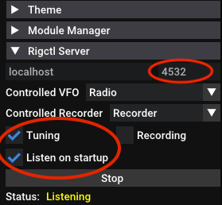

#Cat-relay

## About
Cat-relay is a tool to change your SDR into a band scope/panadapter
for your radio. It does this by synchronizing the frequencies and modes
of your SDR software and your radio transceiver.

## Supported platforms and software
Cat-relay is written in Python3 and can run on Mac, Windows and Linux. However, the main use case is running SDR++ 
(cross-platform) with RUMlogNG or Flrig on MacOS or DXLab Commander on Windows. 

Cat-relay may work with other SDR software if the SDR provides a
Hamlib/Rigctl compatible TCP server. Cat-relay should work with other
logging software and rig control software if they provide one of two interfaces:

* A DXLab Commander compatible TCP server. RUMlogNG provides one of
  these if it is controlling the radio itself.
* A rig control server that uses an XML/RPC interface such as Flrig.

At this moment, only SDR++, RUMlogNG, DXLab Commander, and Flrig are
tested. MacLoggerDX will also work, except changing modes on SDR is not supported by MacLoggerDX. 


##  How cat-relay works
Cat-relay can work with two
different types of transceiver-computer setups (see figure below):

1. **Logger-controlled radio:** A logging software app like DXLabs Commander or
   RUMlogNG connects directly to the transceiver using a CAT
   interface. The logger interacts with all other applications wanting
   to control the radio.
2. **Server-controlled radio:** A rig control server app like Flrig connects to the
radio using a CAT interface. All other programs wishing to control the
transceiver talk to the rig control server.


You can configure which configuration you are using in the file config.yml through the setting of the variable LOGGER_MODE. At present, it can have three possible values:

1. **`dxlab`:** Set LOGGER_MODE to `dxlab` to run cat-relay in a logger-controlled radio configuration.
2. **`flrig`:** Set LOGGER_MODE to `flrig` to run cat-relay in a server-controlled radio configuration.
3. **`wb:`** The value `wb` appears to configure cat-relay to interact with an undocumented/unsupported N1MM+ configuration.

Cat-relay reads frequencies and modes from SDR and the application
controlling your transceiver every 50ms (configurable), and synchronizes them if either
of them changes. Cat-relay, SDR, logging software, and Flrig can run on the same computer or different computers in the same local
network.

## 1. Logger-controlled Radio Configuration
A logger-controlled radio configuration is just what its name implies: a logger program such as DXLabs Commander or RUMlogNG has direct control of your transceiver via a serial or USB CAT interface. This type of configuration is often used in contesting where the logger program sends and receives pre-programmed CW, voice, or RTTY exchanges. Should any other computer programs want access to the transceiver, they request those operations through the logging program.

When we are running using a logger-controlled ration configuration, cat-relay's job is to synchronize the frequencies and modes between SDR++ and the logging program.

### Settings
To set up your shack for logger-controlled operation, you should:

1. Configure DXLabs Commander or RUMlogNG to control your radio using CAT control through either a serial or USB port.
2. Set "DxLab Suite Commander" to "Start" in RUMLogNG Settings. If you are using DXLab Commander, it's enabled by default. You can change the DX Commander port (52002) by clicking "Net Serv" button in "General" tab.

    
    

3. Check Tuning under "Rigctl Server" in the left-hand menu on SDR++. I typically also check "Listen on Startup" so I don't have to set this every time I run SDR++.

     

4. Modify the file config.yaml as follows:
   - Set the variable Logger_Mode to `DXLab`
	- Set the Logger_IP variable in config.yml to the IP address for DXLabs Commander or RUMLogNG. If you are running those programs on the same computer, the address 127.0.0.1 will work just fine.
	- Set the Logger_PORT variable in config.yml to 5555 for RUMlogNG or 52002 if you are using DXLabs Commander. 
	- If you have modified the server ports your logger is listening on, ensure that Logger_PORT matches the port number you set.

Once you've made all these changes, ensure that your logger and SDR++ are running before starting cat-relay as described below in the section "How to run".


### Mode mapping
Most common modes such as CW, USB, LSB, AM, and FM are supported in SDR++ and loggers such as RUMlogNG and DXLab Commander and should work properly without modification.
Some modes, however, are only supported in just the SDR or in the radio. For example, my radio (TS-590SG) reports RTTY mode, which SDR++ doesn't support. To address this inconsistency, I've built in the following mappings which should also suit many other users. Should you wish to use different mappings, you can change those mappings in the module `cat_client.py` by modifying the dictionary ALTERNATIVE_MODES.

The mappings as distributed are:

- RTTY mode (from radio) is mapped to USB mode on the SDR.
- WFM mode (from SDR++) will be mapped to FM mode on the radio.
- RAW mode (from SDR++) will not be supported.
- DSB mode (from SDR++) will not be supported.


## 2. Server-Controlled Radio Configuration
A server-controlled radio configuration allows multiple computer applications to control your radio at once. This type of configuration is particularly useful when you have to use an external modem application such as `Fldigi` or `WSJTX` to encode and decode digital signals while still using RUMlogNG or DXlabs Commander to do logging.

Below you can see a screen shot of SDR++, Fldigi, Flrig, and RUMlogNG running while cat-relay synchronizes their frequencies and modes.


The following directions will help you set up cat-relay to use the program `flrig` as the transceiver server and to synchronize its frequencies and modes with SDR++.

#### Settings
To set up your shack for server-controlled operation, you should:

1. Configure flrig to run and control your radio using CAT control through either a serial or USB port.

     

2. Check to ensure that Flrig is listening for XML/RPC connections on port 12345.

     

3. Configure RUMlogNG to use flrig for its transceiver control. This requires setting Manufacturer to "Other", Type to "flrig", Interface to "TCP", Host to "127.0.0.1", and Port to "12345".

    

4. Check Tuning under "Rigctl Server" in the left-hand menu on SDR++. I typically also check "Listen on Startup" so I don't have to set this every time I run SDR++.

     

5. Modify config.yml as follows: 
     - Logger_Mode: flrig
     - RADIO_FLRIG_IP: 127.0.0.1
     - RADIO_FLRIG_PORT: 12345

Once you've made all these changes, ensure that flrig and SDR++ are running before starting cat-relay as described below in the section "How to run".

### Mode mapping
Just as in the case of a logger-controlled radio, some radio modes are not supported by SDR++ and vice versa. Further, when running digital modes, you may find it desirable to tell your transceiver to use its DATA connection for input and to mute the microphone. What this means is that we have to do two types of mode mapping: one to translate SDR modes into those for the transceiver, and another to map transceiver modes into SDR ones.

To perform this mapping, the module flrig.py (the module that talks to the flrig radio server) has two dictionaries named SDR_TO_RADIO and RADIO_TO_SDR. The mode translations included are appropriate for the modes offered in an Icom IC-7100; you may have to change them for your own use. If you do a lot more voice work than digital, for example, you probably want to change SDR_TO_RADIO mappings for the voice modes to not use DATA mode (i.e., change the entry USB:USB-D to USB:USB and LSB:LSB-D to LSB:LSB).

The distributed mappings are as follows:

    RADIO_TO_SDR = {
     'LSB':'LSB',
     'USB':'USB',
     'AM':'AM',
     'CW':'CW',
     'RTTY':'USB',
     'FM':'NFM',
     'WFM':'WFM',
     'CW-R':'CW',
     'RTTY-R':'USB',
     'DV':'NFM',
     'LSB-D':'LSB',
     'USB-D':'USB',
     'AM-D':'AM',
     'FM-D':'NFM'
    }

    SDR_TO_RADIO = {
    'LSB':'LSB-D',
    'USB':'USB-D',
    'AM':'AM-D',
    'DSB':'AM',
    'NFM':'FM',
    'WFM':'WFM',
    'CW':'CW',
    'RAW':'USB'
    }


## Dependencies
Cat-relay uses only one 3rd party libraries (pyyaml). To install it, open a terminal, go to the folder that contains cat-relay, 
and run following command:

```pip3 install -r requirements.txt```

## How to run
Open a terminal, go to the folder that contains cat-relay, and run following command:

```python3 listen.py```

Don't close the terminal window, you can minimize it if you'd like to.

## How to quit
Open the terminal window that cat-relay is running in and press Ctrl+C.
